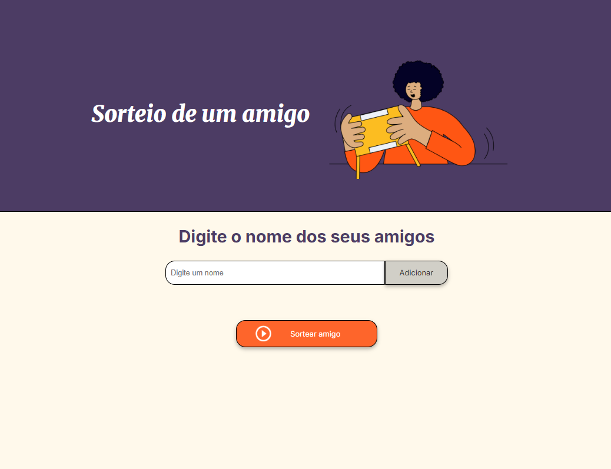

<h1> 
  Sorteio Individual de Amigo (Desafio "Amigo Secreto") 
</h1>

Este projeto faz parte do desafio do programa ONE (Oracle Next Education), uma iniciativa da Oracle, Alura e FIAP para formar profissionais em tecnologia com foco em IA, Ciência de Dados, Back-End e certificação Oracle Cloud. A aplicação é um sistema interativo para sorteio de uma pessoa secreta a partir de uma lista, desenvolvido com HTML, CSS e JavaScript. Diferente do tradicional amigo secreto, este sistema sorteia apenas um nome para cada usuário, sem realizar trocas ou interações entre participantes. O desafio visa aplicar conhecimentos de programação e lógica para criar uma interface web funcional, responsiva e intuitiva, fortalecendo habilidades essenciais em desenvolvimento front-end.

  

## ⚙️ Funcionalidades

- **Adicionar Participantes:** Permite inserir os nomes das pessoas que farão parte do sorteio. O sistema valida os campos para evitar entradas vazias ou repetidas.
- **Visualização Dinâmica:** A lista de nomes é atualizada em tempo real, possibilitando que o usuário visualize e confira os amigos adicionados.
- **Realizar o Sorteio:** Com um simples clique, a aplicação sorteia de forma totalmente aleatória um nome da lista.

## 🛠️ Tecnologias utilizadas

- **HTML5**: estrutura da página
- **CSS3**: estilização e responsividade
- **JavaScript**: lógica de funcionamento e sorteio

---

## 🎓 Habilidades Aprimoradas: 

Neste projeto, apliquei e aprofundei os seguintes conceitos:

- **Estrutura HTML Semântica**: Organização do projeto com tags como `<main>`, `<header>`, `<section>`, e `<ul>` para melhorar a acessibilidade e a clareza do código.
- **Estilização com CSS Avançado**: Uso de **variáveis CSS (`:root`)** para padronizar cores e **Flexbox (`display: flex`)** para criar layouts responsivos e centralizar elementos.
- **Manipulação do DOM**: Seleção e alteração de elementos HTML com JavaScript para atualizar a interface dinamicamente.
- **Lógica de Programação**: Implementação de funções, condicionais e laços de repetição para gerenciar a lógica de adição de nomes e o sorteio.

## 👩🏽‍💻 Autora

Desenvolvido por **Tânia**, como parte do desafio de aprendizado da [Alura](https://www.alura.com.br/) e **[Oracle Next Education](https://www.oracle.com/br/education/oracle-next-education/)**.
Este projeto é um marco importante na minha jornada de programação e uma demonstração prática das habilidades adquiridas.

## 🚀 Projeto Online

Este projeto foi implantado no Vercel. Você pode acessá-lo [clicando aqui](https://amigo-secreto-da-tantan.vercel.app/).

## 📷 Preview

---

## 💡 Projeto Open Source

Desenvolvido como laboratório de aprendizado, este projeto convida você a:
- ✨ Explorar e entender o código
- 🔀 Fazer fork e criar suas próprias versões  
- 🤝 Contribuir com melhorias
- 📖 Usar como referência em seus estudos

*O conhecimento cresce quando compartilhado!*
